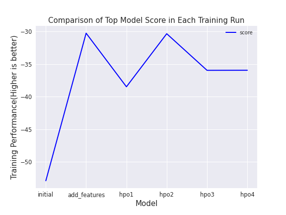
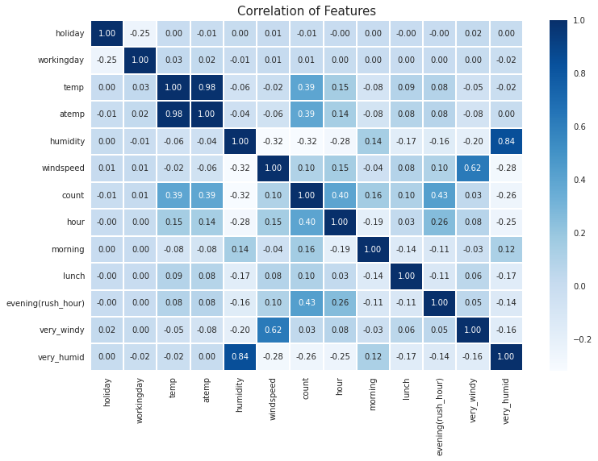

# Report: Predict Bike Sharing Demand with AutoGluon Solution
#### JOSEPH NGOTA CHILO

## Initial Training
### What did you realize when you tried to submit your predictions? What changes were needed to the output of the predictor to submit your results?
Kaggle does not accept negative values in the predictions. As such, all values less than zero were replaced with zero.

### What was the top ranked model that performed?
The WeightedEnsemble_L3 model perfomed best in initial training with a training score of -52.882914
The top 5 models in this initial training were:

|Rank|Model|Training Score|
|----|-----|--------------|
|1|WeightedEnsemble_L3|-52.883|
|2|RandomForestMSE_BAG_L2|-53.466|
|3|ExtraTreesMSE_BAG_L2|-53.874|
|4|LightGBM_BAG_L2|-55.218|
|5|CatBoost_BAG_L2|-55.664|

## Exploratory data analysis and feature creation
### What did the exploratory analysis find and how did you add additional features?
The data initially contained 11 features and the target feature, count. Two features, casual and registered, that were not in the test set were dropped when training models.  
Exploratory data analysis was done to observe the distribution of these 11 features. This was achieved by plotting histograms of each feature.  
The following observations were made from observing these distributions:
- The distributions of two features, weather and season, identified them as categorical features. Weather had 3 categories and season 4 categories.
- Holiday and working day were identified as binary features.
- Temp and atemp had normal distributions.
- The distribution of Humidity was skewed right, whereas the distributions of windspeed, casual, registered, and count were skewed left.

With a view to improving model performance, I added 7 additional features. The features were:

1. Hour - Hour was extracted from datetime and represents the hour the bike was rented.

2. Morning - This binary feature was extracted from hour. Any hour from 0700hrs to 0900hrs was classified as morning, and given the value 1 with all other hours given 0.

3. Lunch - This binary feature was extracted from hour. Any hour from 1100hrs to 1300hrs was classified as lunch, and given the value 1 with all other hours given 0.

4. Evening(rush-hour) - This binary feature was extracted from hour. Any hour from 1700hrs to 1800hrs was classified as evening(rush-hour), and given the value 1 with all other hours given 0.

5. Temp_category - This categorical feature was extracted from temp(temperature). Any temperature less than 10 is cold and given the value 0. Any temperature greater than or equal to 10 but less than or equal to 30 was classified as mild and given the value 1, and any temperature greater than 30 is hot and given the value 2.

6. Very_windy - This binary feature was extracted from windspeed. Windspeed greater than 25 is classified as very_windy and assigned the value 1. Windspeed below or equal to 25 is assigned the value 0.

7.  Very_humid - This binary feature was extracted from humidity. humidity greater than 60 is classified as very_humid and assigned the value 1. Humidity below or equal to 60 is assigned the value 0.

### How much better did your model preform after adding additional features and why do you think that is?
There were two scores involved, the training score value and the Kaggle score. The training score follows the model, higher is better, whereas for the Kaggle Score, lower is better. Before adding features, the best model trained had a training score of -52.882914 and the Kaggle score obtained was 1.80815. After adding features, the best model trained had a training score of -30.26994, and a Kaggle score of 0.65756 obtained.   

There was a huge improvement on the model performance in both the training and test(Kaggle) scores, with the Kaggle score reduced by more than half the initial score. This is because adding features leads to a better representaion of the structure of the data thereby providing more information to the model, enabling the model to identify important relationships that it could not identify initially. The result is a reduction in underfitting, a more accurate model that generalizes better on new unseen data.

## Hyper parameter tuning
### How much better did your model preform after trying different hyper parameters?
Four rounds of hyperparameter tuning were done. In the first round, the  hyperparameters for GBM models were provided, the result was an improved score of 0.52078, down from the 0.65756 obtained by adding features. 

The second round of tuning saw CAT and GBM hyperparameters provided, the model performed worse compared to the first tuning, with an increased score of 0.66165.  

The third round of tuning saw the CAT hyperparameters dropped and NN_TORCH hyperparameters used in conjunction with the GBM hypeparameters, the best model performance, a Kaggle score of 0.46235, was obtained.  

The fourth round saw CAT, GBM and NN_TORCH hyperparameters used and the model performance dropped to an increased Kaggle score of 0.46279, worse compared to round 3.
Thus the best model was the round three set, a combination of GBM and NN_TORCH hyperparameters, with a score of 0.46235.

### If you were given more time with this dataset, where do you think you would spend more time?
Adding more features and hyperparameter optimization.  
- Adding more features from existing features such as  day of the week and month from datetime.  
- Hyperparameter Optimization to try different hyperparameters for other separate algorithms other than the three used, or even trying different values for the hyperparameters of the three algorithms used and observing any changes in model performance.
### Create a table with the models you ran, the hyperparameters modified, and the kaggle score.
|model|hpo1|hpo2|hpo3|hpo4|Best score|
|--|--|--|--|--|--|
|initial|1.80815|1.80815|1.80815|1.80815|1.80815|
|add_features|0.65756|0.65756|0.65756|0.65756|0.65756|
|hpo|0.52078|0.66165|0.46235|0.46279|0.46235|

### Create a line plot showing the top model score for the three (or more) training runs during the project.

### Create a line plot showing the top kaggle score for the three (or more) prediction submissions during the project.

### Correlation of Features

## Summary
This report outlines the process of predicting bike sharing demand using AutoGluon. It covers initial training, where the top-ranked model was the WeightedEnsemble_L3. The initial Kaggle score was 1.80815. Exploratory data analysis led to the addition of seven additional features. The model's performance significantly improved after adding features, achieving a Kaggle score of 0.65756. Hyperparameter tuning was conducted in four rounds, with the best model combination of GBM and NN_TORCH achieving a Kaggle score of 0.46235.